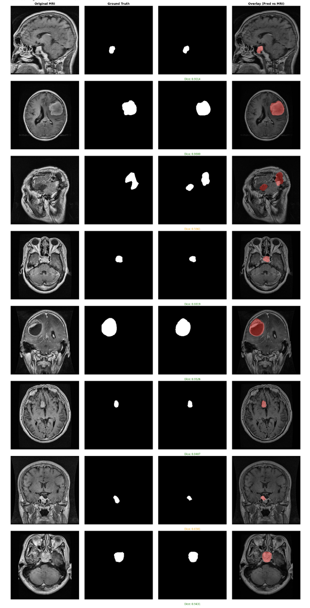

# Brain Tumor Segmentation using Hybrid SAM 2.1 & U-Net++ 🧠

## 📌 Project Overview

This project implements a state-of-the-art **Hybrid Segmentation Architecture** for identifying brain tumors in MRI scans. By combining the robust feature extraction capabilities of Meta's **Segment Anything Model (SAM 2.1)** with the specialized medical segmentation architecture of **U-Net++ (EfficientNet-B7 backbone)**, we achieved high-precision segmentation results without requiring massive labeled datasets. This project used kaggle platform for GPU support, thus do not forget to change the file paths.

**Key Achievement:**
🚀 **Dice Score: 0.8369** (Validation) after just 15 epochs of fine-tuning.

---

## 🔬 Methodology: The Hybrid Approach

Standard U-Nets often struggle with low-contrast medical images when trained from scratch on small datasets. To overcome this, we employed a **feature-injection strategy**:

### 1. Feature Extraction (Frozen Backbone)

* We utilize the **Image Encoder** from Meta's **SAM 2.1 tiny**.


* This foundation model provides rich, generalized visual features (edge detection, texture analysis) "out of the box."
* **Technical Detail:** We extract features from the deepest layer of the SAM pyramid to capture high-level semantic information. Since SAM expects 1024x1024 inputs, we implemented an internal upscale-downscale pipeline to maintain compatibility with our medical imagery.

### 2. Segmentation Network (Trainable)

* We use **U-Net++** with an **EfficientNet-B7** encoder.
* **Fusion Strategy:** The high-dimensional features from SAM are compressed (via a 1x1 Convolution Adapter) and injected into the U-Net's input stream.
* This gives the U-Net a "head start," allowing it to focus on refining the tumor boundaries rather than learning basic image processing filters.

### 3. Training Pipeline

* **Loss Function:** Binary Dice Loss.
* **Optimizer:** AdamW with Cosine Annealing Scheduler.
* **Resolution:** 256x256 (Input), Upscaled to 1024x1024 internally for SAM compatibility.

---

## 📊 Results & Visualization

The model demonstrates exceptional ability to localize tumors, even in challenging scans with irregular shapes.

### Performance Metrics

| Metric | Score |
| --- | --- |
| **Max Validation Dice** | **0.8369** |
| **Final Training Loss** | 0.0646 |
| **Epochs** | 15 |

### Visual Inference Gallery

*Below is a random selection of test samples. The **Red Overlay** represents the model's prediction compared to the Ground Truth.*

*(Note: Upload the 'Screenshot 2026-01-03...' image to your repo and paste the link here)*

**Observations:**

* **High Precision:** The model accurately traces the contours of Gliomas, Meningiomas, and Pituitary tumors.
* **Robustness:** Effectively handles variations in tumor size and location.
* **Artifact Resistance:** Ignores skull and other non-brain tissues effectively.

---

## 🛠️ Installation & Usage

### Prerequisites

* Python 3.8+
* NVIDIA GPU (Recommended: 16GB+ VRAM due to EfficientNet-B7 size)

### 1. Clone the Repository

### 2. Install Dependencies

```bash
pip install torch torchvision segmentation-models-pytorch ultralytics opencv-python matplotlib scikit-learn

```

### 3. Data Setup

Organize your dataset as follows:

```text
DATASET/
├── classification/
└── Segmentation/
    ├── Glioma/
    │   ├── image1.png
    │   ├── image1_mask.png
    │   └── ...
    ├── Meningioma/
    └── Pituitary tumor/

```

### 4. Run Training

```python
# Run the training script (ensure path to dataset is correct)
python train.py

```

---

## 📂 File Structure

* `train.py`: Main script for loading data, building the hybrid model, and training.
* `README.md`: Project documentation.

---

## 🧠 Future Improvements

* **3D Segmentation:** Extend the model to process full 3D MRI volumes (NIfTI format) instead of 2D slices.
* 
**Text Prompting:** Integrate SAM 3's text capabilities to allow segmentation via prompts like "segment the necrotic core".


* **Ensembling:** Combine predictions from U-Net++ and DeepLabV3+ for even higher accuracy.

---

## 🤝 Acknowledgments

* **Dataset:** [Brain Tumor Segmentation Dataset](https://www.kaggle.com/datasets/indk214/brain-tumor-dataset-segmentation-and-classification)
* **Libraries:** [Ultralytics (SAM)](https://github.com/ultralytics/ultralytics), [Segmentation Models PyTorch](https://github.com/qubvel/segmentation_models.pytorch)

### Visual Inference Gallery
*Below is a random selection of test samples. The **Red Overlay** represents the model's prediction compared to the Ground Truth.*



